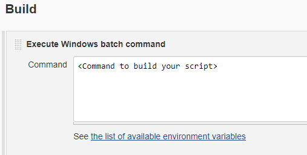

# Jenkins CI

## Overview <a href="#overview" id="overview"></a>

Jenkins offers a simple way to set up a continuous integration or continuous delivery environment for almost any combination of languages and source code repositories using pipelines, as well as automating other routine development tasks. **** It is commonly used to build, test and deploy applications when there are new changes to your source code. Integrating Scantist SCA as part of your development life cycle enforces security and licensing compliance in the CI/CD pipeline.&#x20;

There are 2 options to integrate Scantist SCA with your Jenkins CI:

### Option 1: **Build Script on Jenkins CI**

Follow the following steps to integrate Scantist SCA to your Jenkins CI using the Build scripts on Jenkins CI.

#### Step 1 - Get Access Token <a href="#step-1-get-access-token" id="step-1-get-access-token"></a>

The access token allows Jenkins CI to communicate with Scantist SCA. To learn how to get your access token click [here](jenkins-ci.md#step-1-get-access-token).

#### Step 2 - Configure script for Jenkins <a href="#step-2-configure-script-for-jenkins" id="step-2-configure-script-for-jenkins"></a>

1. Once you have copied your access token, navigate back to Jenkins tools.
2.  On Jenkins, click on **Configure** of your project.&#x20;

    <figure><figcaption><p>Jenkins configuration</p></figcaption></figure>
3.  Under Build, ensure that you have the script ready to build your project. Building your project helps Scantist SCA to collect not just the direct dependencies but also the transitive dependencies. If you do not have a build script, you can skip this step.&#x20;

    <figure><figcaption><p>Jenkins configuration - build</p></figcaption></figure>
4. For **windows** user, add a new **Execute Windows batch command**, and insert the command below


```bash
SET SCANTIST_IMPORT_URL=$dedicated_deployment_scantist_url
SET SCANTISTTOKEN=$your_copied_access_token

curl -s https://scripts.scantist.com/ci-jenkins.sh --output ci-jenkins.sh
CALL ci-jenkins.sh

exit 0
```


5. For **Linux** user, add a new **Execute Shell**, and insert the command below:


```bash
export SCANTIST_IMPORT_URL=$dedicated_deployment_scantist_url
export SCANTISTTOKEN=$your_copied_access_token

curl -s https://download.scantist.io/scantist-bom-detect.jar --output scantist-bom-detect.jar

java -jar scantist-bom-detect.jar
```


6. Once the command has been added, click **Save**, and **Build Now**. The project will start building and it will call the Scantist Jenkins script to receive your built result from Jenkins.

### **Option 2 - Using Jenkinsfile** <a href="#option-2-using-jenkinsfile" id="option-2-using-jenkinsfile"></a>

Follow the following steps to integrate Scantist SCA to your Jenkins CI using the Jenkinsfile.

#### Step1 - Get Access Token

The access token allows Jenkins CI to communicate with Scantist SCA. To learn how to get your access token click **** [here](jenkins-ci.md#step-1-get-access-token).

#### Step2 - Environment Variables

1. Once you have copied your access token, navigate back to Jenkins tools.
2. On Jenkins, select **Manage Jenkins** > **Configure System** > **Global properties** > **Environment Variables**.
3. Add 2 variables, and click **Apply** > **Save**.

| Environment Variables     | Values                               | Required  |
| ------------------------- | ------------------------------------ | --------- |
| **SCANTISTTOKEN**         | token\_you\_copied                   | Mandatory |
| **SCANTIST\_IMPORT\_URL** | dedicated\_deployment\_scantist\_url | Optional  |

<figure><figcaption><p>Jenkins enviornment variable set up page</p></figcaption></figure>

#### Step 3 - Add Scantist agent to Jenkinsfile <a href="#step-3-add-scantist-agent-to-jenkinsfile" id="step-3-add-scantist-agent-to-jenkinsfile"></a>

1. Next, navigate to your source code repository, and open up your **Jenkinsfile**.
2. You can **add a new stage** **under your stages**, and name it as **Scantist** with the following command:


```bash
stage ('Scantist') {
    steps {
        sh '''
            curl -s https://download.scantist.io/scantist-bom-detect.jar --output scantist-bom-detect.jar
            java -jar scantist-bom-detect.jar
        '''
    }
}
```


1. (**On-premise**) If your source code is hosted on-prem, you will need to download the [Scantist agent](https://scripts.scantist.com/staging/scantist-bom-detect.jar) from an internet-connected device first.
2. (**On-premise**) And on your **Jenkinsfile**, **add a new stage** **under your stages**, and name it as **Scantist** with the following command:


```bash
stage ('Scantist') {
    steps {
        sh 'java -jar /where/scantist-agent/located/scantist-bom-detect.jar'
    }
}
```


#### Step 4 - Build it! <a href="#step-4-build-it" id="step-4-build-it"></a>

Once the command has been added, navigate back to Jenkins and select **Build Now** for your project. The project will start building and it will call the Scantist Jenkins script to receive your successfully built result from Jenkins.

****

